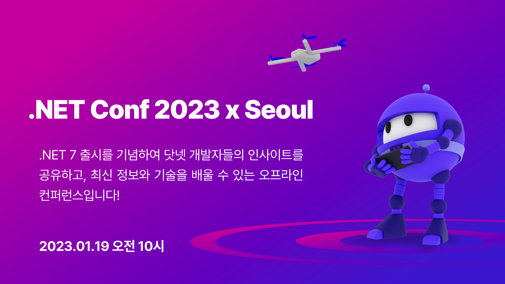

# .NET Conf 2023 x Seoul

`dotNETConf` 폴더에서는 2023년 1월 19일에 진행한 행사를 기록하고 있습니다.

컨퍼런스 일정 및 자세한 내용은 아래 페이지를 확인해주세요.

https://dotnetconf.kr/2023

---

# 1. 키노트 - 이건복님

* **발표 자료**: [PDF](Breakout-01-dotnet-conf-_Seoul.pdf)
* **발표 영상 (공개 전)**:

---

# 2. “고성능" 튜닝으로 Blazor 애플리케이션 개발을 시작해 봅시다! - Motoki Nakae님

* **발표 자료**: [Web, 데스크톱 브라우저 필요](https://igjp-sample.github.io/DotNETConf2023Seoul/)
* **발표 영상 (공개 전)**:

---

# 3. ASP.NET Core 애플리케이션 모니터링 - 박정훈님

* **발표 자료**: [PPTX](Breakout-03-aspnetCoreMonitoring.pptx)
* **발표 영상 (공개 전)**:

---

# 4. Serilog를 통해 애플리케이션 데이터를 수집하고 분석하기 - 이수호님

* **발표 자료**: [PPTX](Breakout-04-Serilog를 통해 애플리케이션 데이터를 수집하고 분석하자.pptx)
* **발표 영상 (공개 전)**:

---

# 5. 윈도우 기반 서버를 클라우드 친화적으로 바꾸는 법 (feat. 윈도우 컨테이너) - 남정현님

* **발표 자료**: [PPTX](Breakout-05-dotnetconf-seoul-2023-rkttu.pptx)
* **발표 영상 (공개 전)**:

---

# 6. .NET Framework 기반 SaaS 솔루션 .NET 6 전환기 - 한재준님

* **발표 자료**: [PDF](Breakout-06-dotnetconf2023_크레비스파트너스_한재준.pdf)
* **발표 영상 (공개 전)**:

---

# 7. 나만의 To-do 앱 빌드하기 (feat. Blazor & CosmosDB) - 강연정님

* **발표 자료**: [PPTX](Breakout-07-dotnetconf2023_YounjungKang.pptx)
* **발표 영상 (공개 전)**:

---

# 8. MAUI Community Toolkit을 활용한 효과적인 MAUI 앱 개발 - 조중현님

* **발표 자료**: [PPTX](Breakout-08-dotnetconf2023-MCT-조중현.pptx)
* **발표 영상 (공개 전)**:

---

# 9. .NET 6와 Azure 액티브 디렉터리로 웹 애플리케이션 사용자 관리하기 - Mats Lundell-Nygjelten님

* **발표 자료**: [PDF](Breakout-09-AD B2X - Identity and Access Management for Customers and Partners.pdf)
* **발표 영상 (공개 전)**:

---

# 10. C# 11 static abstract members 이해와 대비 - 김주호님

* **발표 자료**: [PDF](Breakout-10-slides-export.pdf)
* **발표 영상 (공개 전)**:

---

# 11. 닷넷을 디버깅해 보자! - 오민석님

* **발표 자료**: (공개 전)
* **발표 영상 (공개 전)**:

---

# 12. 닷넷 도대체 안되는게 뭐지? - 이종인님

* **발표 자료**: [PPTX](Breakout-12-[이종인] .NET 안되는 게 뭔가요.pptx)
* **발표 영상 (공개 전)**:

---

# 13. MVVM Toolkit을 사용하려는 개발자를 위한 안내 - 박문찬님

* **발표 자료**: [PPTX](Breakout-13-dotnetconf2023-deck-박문찬.pptx)
* **발표 영상 (공개 전)**:

---

# 14. Windows Dev Kit 2023 체험해보기 - 이재웅님

* **발표 자료**: [PPTX](BirdsOfFeather-14-DevKit2023.pptx)

---

# 15. Spread.NET과 함께하는 쾌-적 Excel 개발 - 이상준님

* **사전 준비**: [PDF](HOL-15-Requirements-NET6 Nuget패키지를 통해 Spread.NET 설치방법.pdf)
* **발표 자료**: [PPTX](HOL-15-dotnetconf2023.pptx)
* **실습 콘텐츠**: [GitHub](https://github.com/christian289/dotnetconf2301)

---

# 16. 닷넷 개발자를 위한 깃헙 코드스페이스 설정 - Justin Yoo님

* **사전 준비**
  * [GitHub 무료 계정](https://github.com/signup)
  * [Azure 무료 계정](https://azure.microsoft.com/ko-kr/free?WT.mc_id=dotnet-84111-juyoo)
  * [Docker Desktop 개인사용자용](https://www.docker.com/get-started/)
  * [Visual Studio Code](https://code.visualstudio.com/Download?WT.mc_id=dotnet-84111-juyoo)
  * [Visual Studio Code - Dev Container 익스텐션](https://marketplace.visualstudio.com/items?itemName=ms-vscode-remote.remote-containers&WT.mc_id=dotnet-84111-juyoo)
* **실습 콘텐츠**: [GitHub](https://github.com/justinyoo/hol-devcontainers-dotnet-ko)

---

# 17. SuperSocketLite로 고성능 Socket 서버 개발하기 - 최흥배님

* **사전 준비**: [Google Docs](https://docs.google.com/document/d/e/2PACX-1vT2D2jKuw4k5cod6xCyKTV0XhYNdjjVU-8veuN-Z7fb_US75LXz1s5nkvNZ6hS2bimmMgJI5UrEnNku/pub)
* **발표 자료**: [PPTX](HOL-17-SuperSocketLite로 고성능 Socket 서버 개발하기 (Hands-on-Lab 세션).pptx)
* **실습 콘텐츠**: [GitHub](https://github.com/jacking75/dotnetconf_2023_SuperSocketLite_handson)

---

# 18. Stl.Fusion 소개 - 실시간 앱 서비스 만들기 - 정세일님

* **사전 준비**: [PDF](HOL-18-Requirements-Stl.Fusion 소개 - 실시간 앱 서비스 만들기.pdf)
* **발표 자료**: [PPTX](HOL-18-Stl.Fusion 소개-실시간 앱 서비스 만들기.pptx)
