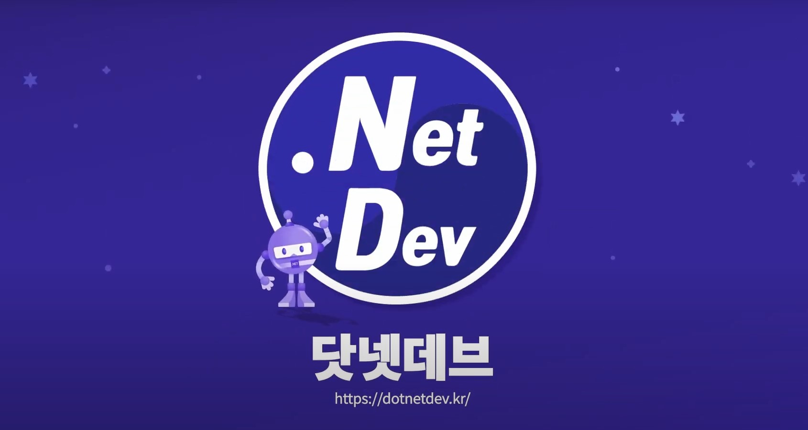

> [!NOTE]
> 이 리포지터리는 .NET Conf x Seoul 행사에 관련된 내용만 포함하고 있습니다. .NET Universe로 리브랜딩된 2026년 이후의 행사 발표 자료와 슬라이드 덱 템플릿은 <https://github.com/dotnetdev-kr/dotnetuniv-presentation> 리포지터리를 확인해주세요.

# 닷넷콘 행사

매년 가을에 발표되는 새로운 버전의 닷넷을 소개하는 .NET Conf 글로벌 행사와 짝을 맞추어 한국에서 개최하는 지역 .NET Conf 행사입니다.
닷넷에 대한 내용을 중심으로 닷넷 개발자 생태계에 대한 종합적인 내용을 다루는 온라인 컨퍼런스입니다.

좀 더 자세한 내용을 알고 싶으면 다음 포럼사이트를 참고해주세요.

<https://forum.dotnetdev.kr/>

이 저장소는 매년 정기적으로 열리는 닷넷콘 행사와 비정기적으로 열리는 닷넷콘 미니에서 발표한 자료를 공유하기 위해 연도별로 폴더를 구성하고 있습니다.

컨퍼런스 일정 및 자세한 내용은 아래 페이지를 확인해주세요.

<https://dotnetconf.kr/>
